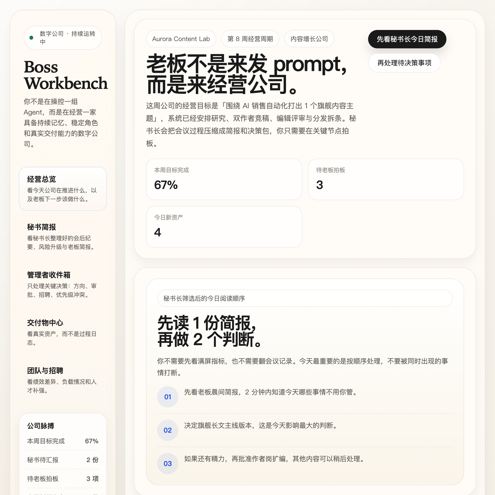

[中文](README.md) | [English](README.en.md)

# Digital Company

> 持续交付的数字内容增长团队，而不是一次性 agent workflow。



`Digital Company` 不是一个“调用一组 agent 干完一次活”的工具。

它是一个面向业务 owner 的产品：你接手的不是临时拼出来的 agent team，而是一支会持续运转、持续记忆、持续协作、持续交付的数字小团队。

第一版的边界刻意收窄为：

## 一支持续运转的数字内容增长团队

---

## 这是什么

- 一个围绕业务目标持续工作的数字团队
- 一个把业务上下文转成 `brief / draft / review / decision / briefing` 的系统
- 一个让老板少介入过程、多介入关键判断的工作台
- 一个会跨周期累积经验，而不是每次都从零开始的执行团队

## 这不是什么

- 不是一次性多 agent 编排
- 不是给 cron 套一层 UI 的 workflow 产品
- 不是“雇几个 AI 员工”的经营游戏
- 不是一个泛化的 AI 公司模拟器
- 不是 prompt playground
- 不是“看起来很热闹，但交付物不落地”的 agent 展示器

---

## 为什么做这个

很多 founder-led 团队、内容负责人、增长负责人，都有明确且持续的业务产出目标，但没有一支真正稳定的执行团队。

他们通常只有三种选择：

1. 自己做，持续被杂事打断
2. 提前招一整支团队，成本高、管理重
3. 用单 agent 工具提效，但拿不到持续团队的记忆、分工、审核和复盘能力

`Digital Company` 想解决的不是“单次任务能不能更快完成”，而是另一个问题：

> 当同一支数字团队持续存在、持续记忆、持续协作、持续交付时，会发生什么？

---

## 产品原则

### 1. 交付优先

这个产品最终要看用户拿到了什么，而不是 agent 之间看起来协作得多热闹。

每个周期都应该产出两类东西：

- `业务资产`
- `管理材料`

### 2. 持续团队，不是临时工作流

这支团队应该跨周存在、跨周期积累上下文、逐步降低老板重复解释业务背景的次数。

### 3. 老板工作台，不是 orchestrator 控制台

默认界面不应该要求用户调度每个 agent。

默认应该回答的是：

- 今天发生了什么
- 这周团队在推进什么
- 最新交付物是什么
- 哪些事情需要我拍板
- 哪些地方有风险

### 4. 组织架构是解释层，不是表演层

组织架构应该帮助老板理解：

- 谁负责什么
- 谁向谁汇报
- 谁和谁在协作
- 哪一段链路在卡住

而不是为了模拟办公室戏剧。

### 5. 复刻有用的人类属性，不复刻人类噪音

我们需要保留的是：

- 角色边界
- 协作关系
- 历史决策
- 反馈沉淀
- 授权和信任

我们不需要先做的是：

- 情绪化人格
- 办公室政治
- 为了“像人”而制造低效率

### 6. 先做“数字小团队”，不做“数字公司平台”

`Digital Company` 这个名字保留了长期方向，但第一版绝不是要做一个泛化的 AI 公司控制平面。

第一版只做一个足够窄、但真正成立的产品对象：

## 数字内容增长团队

---

## 和一般多 agent 产品的区别

表面上看，很多产品都可以表现成：

- 多个角色并行
- 定时开工
- 自动产出一批内容

但本质并不一样。

普通多 agent workflow 更像：

- 到时间触发
- 临时拉起一组角色
- 完成一批任务
- 本次执行结束后状态基本散掉

`Digital Company` 更像：

- 团队长期存在
- 岗位与成员持续存在
- 团队围绕经营节奏推进，而不是围绕单次 prompt 推进
- 团队沉淀偏好、标准、经验和历史判断
- 老板通过简报、审批、复盘和例外处理来管理团队

如果没有这些层，它本质上还是 workflow。  
如果这些层成立，它才开始像一支真正的持续团队。

---

## 核心对象

- `Team`：长期存在的数字团队
- `Cycle`：按周推进的经营节奏
- `Project`：某个周期内的目标单元
- `Task`：具体执行任务
- `Artifact`：交付资产，如 brief、初稿、摘要、报告
- `ArtifactReview`：结构化审核与质量门
- `Briefing`：给老板看的压缩简报
- `Decision`：老板拍板与规则变化
- `MemoryEntry`：经验、反馈与可复用上下文
- `PreferenceProfile`：品牌规则与老板偏好

---

## 默认团队长什么样

第一版默认团队更像一个小型内容增长部门：

- 研究员
- 作者
- 编辑
- 运营 / 分发
- 秘书长

其中秘书长不是装饰角色，而是承上启下的一层：

- 组织会议纪要
- 汇总团队内部争议
- 过滤噪音
- 压缩成老板可快速消费的简报
- 只在需要时升级给老板

老板不是团队里的一个执行节点，而是：

- 定目标
- 做关键审批
- 看关键交付
- 逐步放权

---

## 用户最终拿到什么

第一版要让用户稳定拿到的是“可直接消费的东西”，而不是一堆 agent 过程日志。

### 业务资产

- 本周内容策略卡
- 选题 brief
- 研究摘要
- 长文初稿
- 社媒短内容
- 竞品/行业观察摘要
- 周期复盘

### 管理材料

- 今日 / 本周简报
- 会议纪要
- 待拍板事项
- 风险升级
- 下周期建议

也就是：

## 业务资产 + 管理材料

这两类东西同时成立，产品才既有真实交付价值，也有“接手一个团队”的经营感。

---

## 主界面应该是什么

主界面不是任务控制台，也不是 agent 聊天室。

主界面应该是一个 `BOSS 工作台`，优先展示：

- 本周期目标
- 团队脉搏
- 最新交付
- 待我决策
- 秘书长简报
- 组织架构缩略图

其中组织架构是重要信息层，但不是首页唯一主角。

---

## 技术方向

当前 MVP 技术方向：

- `Next.js`
- `LangGraph.js`
- `PostgreSQL`
- `Inngest`

核心原则：

- PostgreSQL 是业务事实层
- LangGraph 是流程执行器，不是真相来源
- Inngest 负责外层调度与异步编排
- `Artifact / Review / Briefing / Decision` 都是一等对象

---

## 当前进展

目前仓库里已经有：

- 产品定义与边界收敛文档
- 技术可行性调研
- 技术方案草案
- BOSS 工作台原型探索
- 初始 Next.js 项目骨架

当前正在推进：

- 领域模型与数据库 schema
- 工作流运行时骨架
- founding team bootstrap
- BOSS 工作台第一版

---

## 快速开始

```bash
pnpm install
cp .env.example .env.local
pnpm dev
```

然后打开 [http://localhost:3000](http://localhost:3000)

---

## 公开路线图

- [x] 从“数字公司”收敛到“持续内容增长团队”
- [x] 明确核心对象与技术原则
- [x] 搭建工作台骨架
- [ ] 完成第一版 schema foundation
- [ ] 完成 founding team bootstrap
- [ ] 完成 cycle planning flow
- [ ] 完成 briefing / approval loop
- [ ] 完成 artifact production / review flow
- [ ] 完成 memory / feedback loop

---

## 推荐阅读

- 产品定义：[`docs/plans/2026-03-12-digital-company-product-note-v0.3.md`](docs/plans/2026-03-12-digital-company-product-note-v0.3.md)
- 技术方案：[`docs/plans/2026-03-12-digital-company-technical-design-v0.2.md`](docs/plans/2026-03-12-digital-company-technical-design-v0.2.md)
- 实施计划：[`docs/plans/2026-03-13-digital-company-phase0-implementation-plan.md`](docs/plans/2026-03-13-digital-company-phase0-implementation-plan.md)

---

## 参与贡献

这个项目还很早期。当前最有价值的贡献类型包括：

- 产品边界批评
- ICP 与场景收敛建议
- BOSS 工作台的信息架构反馈
- 持续团队记忆 / 协作 / 授权模型的技术建议
- 具体实现 PR

参与前建议先看：

- [`CONTRIBUTING.md`](CONTRIBUTING.md)

---

## 一句话收束

大多数 AI 产品在帮你完成一个任务。  
`Digital Company` 想验证的是：**能不能让一支数字团队持续存在，并持续交付。**
